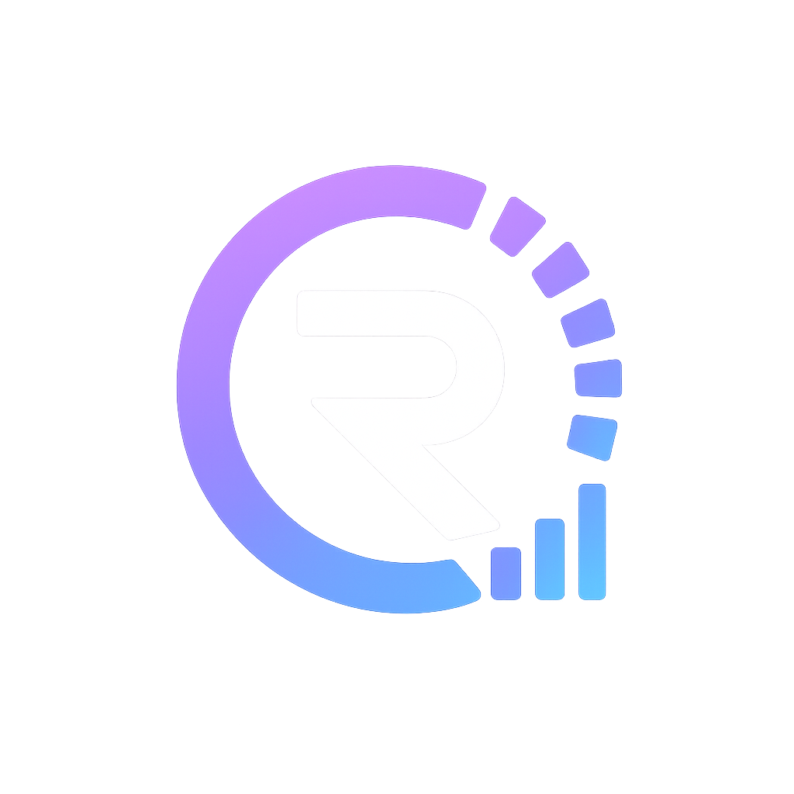

# Health Recovery Dashboard



[](https://github.com/gregorlauritz/MyHealthStatus)

An offline‑first Android app that turns health data from Android **Health Connect** into daily wellness scores.

**Key features**

- Health Connect ingestion (sleep, HR, HRV, exercise)
- Pure‑Kotlin scoring engine (no internet required)
- Material 3 UI with dark mode & interactive Vico charts
- Encrypted local backups

🛠 **Getting Started**
Prerequisites: Android 8.0+ device, Android Studio, Health Connect installed.

```bash
git clone https://github.com/gregorlauritz/MyHealthStatus.git
cd MyHealthStatus
./gradlew installDebug
```

More details, documentation, and the latest releases are on the [website](https://readylytics.com) and in the `docs/` folder.
All three scores adapt to your physiological profile (Athlete, Active, or Sedentary) for fair, personalized interpretation.

## Key Features

- **Health Connect Integration:** Reads sleep, heart rate variability (HRV), resting heart rate (RHR), and exercise data from Android Health Connect.
- **Advanced Metrics:** Calculates TRIMP (Training Impulse), Strain Ratio (ACWR), and baselines using 30-day rolling medians.
- **Personalized Profiles:** Three profile options tune baselines and thresholds to match your lifestyle (sleep consistency targets, HRV sensitivity, etc.).
- **Material 3 UI:** Native Jetpack Compose design with semantic color roles (Success, Error, Tertiary) for health status indicators and dark mode by default.
- **Offline-First:** Local SQLite database (Room) stores all data; UI is driven entirely by local cache. Health Connect is purely a data source.
- **Smart Syncing:** Configurable foreground sync on app return (Never, Always, or by time interval up to 24 hours).
- **Detailed Charts:** Interactive Vico charts with 7-day, 30-day, 180-day, and 1-year views for trend analysis.
- **Workouts Tracking:** View workout history with intensity badges and ACWR trends.
- **Data Backup:** Encrypted local backup and restore for your app data.
- **Background Workers:** Daily sync and cleanup tasks via WorkManager.

## Getting Started

### Prerequisites

- Android 8.0 (API 26) or higher on your device
- Android Health Connect installed and configured with biometric data sources
- Android Studio (latest stable version)

### Installation

1. Clone the repository:

   ```bash
   git clone https://github.com/gregorlauritz/MyHealthStatus.git
   cd MyHealthStatus
   ```

2. Open in Android Studio.

3. Sync Gradle and download dependencies.

4. Create a `local.properties` file in the project root with:

   ```properties
   sdk.dir=/path/to/Android/sdk
   ```

5. Build and run:

   ```bash
   ./gradlew installDebug
   ```

### Release Signing

- Release artifacts are signed only when `READYLYTICS_UPLOAD_STORE_FILE`, `READYLYTICS_UPLOAD_STORE_PASSWORD`, `READYLYTICS_UPLOAD_KEY_ALIAS`, `READYLYTICS_UPLOAD_KEY_PASSWORD`, and `READYLYTICS_UPLOAD_CERT_SHA256` are present.
- `assembleRelease` and `bundleRelease` fail closed through `verifyReleaseSigningInputs`; release builds never fall back to debug signing.
- GitHub Actions release builds also require `READYLYTICS_UPLOAD_STORE_BASE64` so workflow can decode keystore into runner temp directory.
- Full setup, rotation, and dry-run instructions live in `internal-docs/RELEASE_SIGNING.md`.

## Architecture

This project follows clean architecture and MVVM patterns:

- **Single Source of Truth:** UI observes the local Room database exclusively. Health Connect is a data ingestion source only.
- **Repository Pattern:** Data access is abstracted behind repositories (e.g., `SleepRepository`, `WorkoutRepository`).
- **ViewModels:** Use `StateFlow` and `SharedFlow` for reactive state management.
- **Dependency Injection:** Hilt handles all service and module injection.
- **Algorithm Layer:** Pure Kotlin business logic (score calculations, baselines) is decoupled from the Android framework for easy testing.

### Tech Stack

- Language: Kotlin (JVM target 17)
- UI Framework: Jetpack Compose + Material 3
- Local Database: Room Database (SQLite with KSP code generation)
- Dependency Injection: Hilt
- State Management: StateFlow, SharedFlow
- Background Work: WorkManager
- Backup: Encrypted local backup and restore
- Charting: Vico
- Preferences: DataStore
- Data Sync: Health Connect API

### Project Structure

```
app/src/main/
  java/com/gregor/lauritz/healthdashboard/
    data/
      local/          # Room database entities and DAOs
      remote/         # Health Connect adapters
      repository/     # Data repositories
    domain/
      model/          # Domain models
      calculator/     # Pure business logic (scores, baselines)
    ui/
      dashboard/      # Main dashboard screen
      sleep/          # Sleep details
      hrv/            # Heart rate variability
      rhr/            # Resting heart rate
      workouts/       # Workout history and ACWR
      about/          # Educational content
      scaffold/       # Navigation and main layout
      theme/          # Material 3 theme and colors
    workers/          # Background tasks
```

## Notes

- **Offline First:** All calculations run locally. No internet required for scoring engine.
- **Calibration:** Scores are grayed out until at least 7 days of data is available for proper baseline calculation.
- **Wellness, Not Medical:** All metrics are wearable estimates with measurement error. Scores are wellness indicators, not clinical diagnoses.
- **Privacy:** All data is stored locally on your device. Local backups are encrypted and controlled by you. See [Privacy Policy](docs/privacy.md).

## License

[Apache License 2.0](LICENSE)
