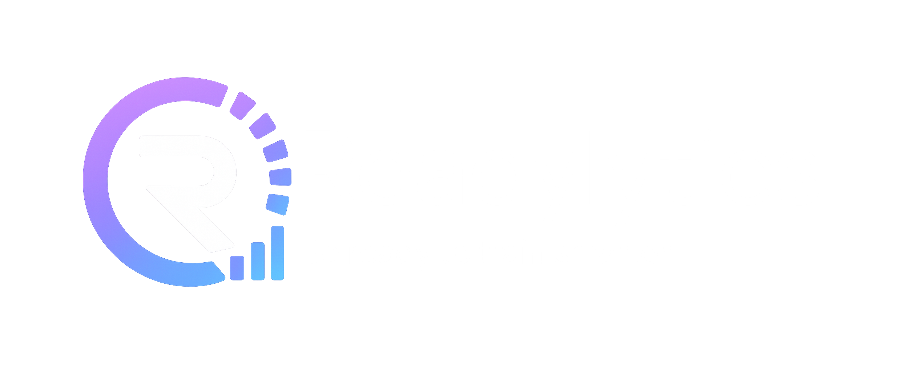

# Readylytics



[](https://github.com/gregorlauritz/MyHealthStatus)
[](https://github.com/gregorlauritz/MyHealthStatus/actions/workflows/ci.yml)

Know your readiness, balance your training load, and optimize recovery with advanced health and performance analytics. Readylytics transforms sleep, HRV, resting heart rate, strain, and training data into actionable insights that help you train smarter and recover better.

This is an offline‑first Android app that turns health data from Android **Health Connect** into daily wellness scores (Sleep, Readiness, Strain, and more).

For full details and user guides, please visit our [website](https://readylytics.com) or explore the local [docs/](docs/) directory.

---

## Key Features

- **Health Connect Ingestion:** Locally imports sleep, heart rate, HRV, and exercise data.
- **Offline-First scoring:** All physiological calculations run locally in Kotlin without network calls.
- **Material 3 UI:** Built using native Jetpack Compose components, support for dynamic color theming, and beautiful charts powered by Vico.
- **Secure Backups:** Local, user-controlled encrypted backups.

## Getting Started

### Prerequisites

- Android 8.0 (API 26) or higher
- Android Health Connect configured on-device
- Android Studio (latest stable version)

### Quick Setup

1. **Clone the repository:**

   ```bash
   git clone https://github.com/gregorlauritz/MyHealthStatus.git
   cd MyHealthStatus
   ```

2. **Open in Android Studio** and sync the project dependencies.
3. **Build & Install:**

   ```bash
   ./gradlew installDebug
   ```

## Development & Documentation

Detailed guidelines are available in:

- [Architecture & Data Flow Details](internal-docs/DATA_FLOW.md)
- [Release Signing Setup](internal-docs/RELEASE_SIGNING.md)
- [Privacy Policy](docs/privacy.md)

## License

This project is licensed under the [Apache License 2.0](LICENSE).
