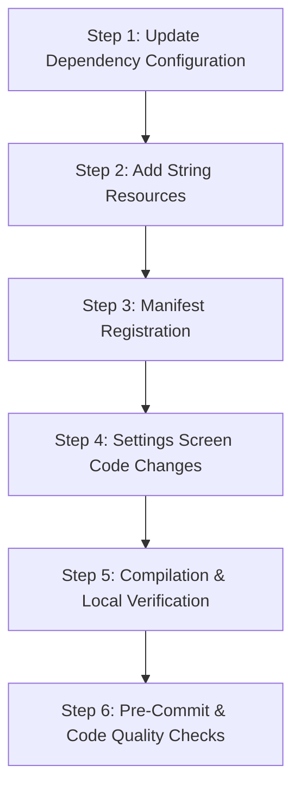

# Implementation Plan: Google OSS Licenses Integration & Settings Reorganization

This plan outlines the specific steps, code changes, and verification tasks to implement the approved design.

---

## 1. Steps and Tasks



### Step 1: Update Dependency Configuration
* **Files to Modify:**
  * [libs.versions.toml](file:///C:/Users/lauri/git/MyHealthStatus/gradle/libs.versions.toml)
  * [build.gradle.kts](file:///C:/Users/lauri/git/MyHealthStatus/build.gradle.kts)
  * [app/build.gradle.kts](file:///C:/Users/lauri/git/MyHealthStatus/app/build.gradle.kts)
* **Changes:**
  * Define version `playServicesOssLicenses = "17.1.0"` and `ossLicensesPlugin = "0.10.6"`.
  * Add `play-services-oss-licenses` dependency and `google-oss-licenses` plugin.
  * Apply `google-oss-licenses` plugin in `app/build.gradle.kts` and add implementation of `play-services-oss-licenses`.

### Step 2: Add String Resources
* **Files to Modify:**
  * [strings.xml](file:///C:/Users/lauri/git/MyHealthStatus/app/src/main/res/values/strings.xml)
* **Changes:**
  * Add `settings_section_miscellaneous` ("Miscellaneous").
  * Add `settings_item_licenses` ("Open source licenses").
  * Add `settings_item_licenses_title` ("Open Source Licenses").

### Step 3: Manifest Registration
* **Files to Modify:**
  * [AndroidManifest.xml](file:///C:/Users/lauri/git/MyHealthStatus/app/src/main/AndroidManifest.xml)
* **Changes:**
  * Register `com.google.android.gms.oss.licenses.OssLicensesMenuActivity` and `com.google.android.gms.oss.licenses.OssLicensesActivity` with the theme `@style/Theme.AppCompat.DayNight.DarkActionBar`.

### Step 4: Settings Screen Code Changes
* **Files to Modify:**
  * [SettingsScreen.kt](file:///C:/Users/lauri/git/MyHealthStatus/app/src/main/kotlin/app/readylytics/health/ui/settings/SettingsScreen.kt)
* **Changes:**
  * Add `collapseMiscellaneous` to `SettingsExpandState`.
  * Add `miscellaneous` metadata item to `settingsSections`.
  * Add the `M3CollapsibleSection` rendering logic inside `SettingsScreen`'s content list.
  * Remove the bottom standalone `Box` containing the `About Readylytics` button.
  * Set up `Intent` and title setter for `OssLicensesMenuActivity` in the licenses clickable item.

### Step 5: Compilation & Local Verification
* **Commands to Run:**
  * Clean build: `./gradlew clean`
  * Compile: `./gradlew assembleDebug`
* **Verification:**
  * Ensure the build completes successfully and manifest merger succeeds.

### Step 6: Pre-Commit & Code Quality Checks
* **Commands to Run:**
  * Format: `./gradlew ktlintFormat`
  * Unit tests: `./gradlew testDebugUnitTest`
  * Sync Index: `codegraph sync` (post-task requirement)

---

## 2. Diffs and Details

### 2.1 Dependencies Diffs
In [libs.versions.toml](file:///C:/Users/lauri/git/MyHealthStatus/gradle/libs.versions.toml):
```diff
 [versions]
+playServicesOssLicenses = "17.1.0"
+ossLicensesPlugin = "0.10.6"
 
 [libraries]
+play-services-oss-licenses = { group = "com.google.android.gms", name = "play-services-oss-licenses", version.ref = "playServicesOssLicenses" }

 [plugins]
+google-oss-licenses = { id = "com.google.android.gms.oss-licenses-plugin", version.ref = "ossLicensesPlugin" }
```

In [build.gradle.kts](file:///C:/Users/lauri/git/MyHealthStatus/build.gradle.kts):
```diff
 plugins {
+    alias(libs.plugins.google.oss-licenses) apply false
 }
```

In [app/build.gradle.kts](file:///C:/Users/lauri/git/MyHealthStatus/app/build.gradle.kts):
```diff
 plugins {
+    alias(libs.plugins.google.oss-licenses)
 }

 dependencies {
+    implementation(libs.play-services-oss-licenses)
 }
```

### 2.2 Manifest Registration Diffs
In [AndroidManifest.xml](file:///C:/Users/lauri/git/MyHealthStatus/app/src/main/AndroidManifest.xml):
```diff
         <!-- Service or other activities -->
+        <activity
+            android:name="com.google.android.gms.oss.licenses.OssLicensesMenuActivity"
+            android:theme="@style/Theme.AppCompat.DayNight.DarkActionBar"
+            android:exported="false" />
+        <activity
+            android:name="com.google.android.gms.oss.licenses.OssLicensesActivity"
+            android:theme="@style/Theme.AppCompat.DayNight.DarkActionBar"
+            android:exported="false" />
     </application>
```

### 2.3 Strings Diffs
In [strings.xml](file:///C:/Users/lauri/git/MyHealthStatus/app/src/main/res/values/strings.xml):
```diff
     <!-- Settings Screen Sections & Sub-headers -->
+    <string name="settings_section_miscellaneous">Miscellaneous</string>
+    <string name="settings_item_licenses">Open source licenses</string>
+    <string name="settings_item_licenses_title">Open Source Licenses</string>
```

### 2.4 Settings Screen Diffs
In [SettingsScreen.kt](file:///C:/Users/lauri/git/MyHealthStatus/app/src/main/kotlin/app/readylytics/health/ui/settings/SettingsScreen.kt):
```diff
 data class SettingsExpandState(
     val genderExpanded: Boolean = false,
     val collapseDataBackup: Boolean = false,
     val collapseDataSources: Boolean = false,
     val collapseBaselinesThresholds: Boolean = false,
     val collapseDisplay: Boolean = false,
     val collapseAdvanced: Boolean = false,
+    val collapseMiscellaneous: Boolean = false,
     val aboutDismissed: Boolean = false,
 ) : Parcelable
```

```diff
 val settingsSections =
     listOf(
         ...
         SettingsSectionMetadata(
             id = "advanced",
             name = "Advanced",
             keywords = listOf("advanced", "override", "pai", "resting", "hr timing"),
         ),
+        SettingsSectionMetadata(
+            id = "miscellaneous",
+            name = "Miscellaneous",
+            keywords = listOf("miscellaneous", "about", "licenses", "open source", "legal"),
+        ),
     )
```

```diff
                 // Advanced
                 if (matchingSections.any { it.id == "advanced" }) {
                     ...
                 }
+
+                // Miscellaneous (About & Licenses)
+                if (matchingSections.any { it.id == "miscellaneous" }) {
+                    M3CollapsibleSection(
+                        header = stringResource(R.string.settings_section_miscellaneous),
+                        expanded =
+                            !expandState.collapseMiscellaneous ||
+                                shouldExpandSection("miscellaneous"),
+                        onExpandedChange = {
+                            expandState = expandState.copy(collapseMiscellaneous = !it)
+                        },
+                    ) {
+                        Column {
+                            ListItem(
+                                colors = ListItemDefaults.colors(containerColor = androidx.compose.ui.graphics.Color.Transparent),
+                                headlineContent = {
+                                    Text(
+                                        text = stringResource(R.string.settings_about_button),
+                                        style = MaterialTheme.typography.bodyLarge,
+                                    )
+                                },
+                                modifier = Modifier.clickable { onNavigateToAbout() }
+                            )
+                            HorizontalDivider(modifier = Modifier.padding(vertical = 4.dp))
+                            ListItem(
+                                colors = ListItemDefaults.colors(containerColor = androidx.compose.ui.graphics.Color.Transparent),
+                                headlineContent = {
+                                    Text(
+                                        text = stringResource(R.string.settings_item_licenses),
+                                        style = MaterialTheme.typography.bodyLarge,
+                                    )
+                                },
+                                modifier = Modifier.clickable {
+                                    com.google.android.gms.oss.licenses.OssLicensesMenuActivity.setActivityTitle(
+                                        context.getString(R.string.settings_item_licenses_title)
+                                    )
+                                    context.startActivity(
+                                        android.content.Intent(context, com.google.android.gms.oss.licenses.OssLicensesMenuActivity::class.java)
+                                    )
+                                }
+                            )
+                        }
+                    }
+                }
             }
         }
-
-        Box(
-            modifier =
-                Modifier
-                    .fillMaxWidth()
-                    .padding(bottom = 12.dp),
-            contentAlignment = Alignment.Center,
-        ) {
-            TextButton(onClick = onNavigateToAbout) {
-                Text(
-                    text = stringResource(R.string.settings_about_button),
-                    style = MaterialTheme.typography.labelLarge,
-                    color = MaterialTheme.colorScheme.onSurfaceVariant,
-                )
-            }
-        }
     }
 }
```
