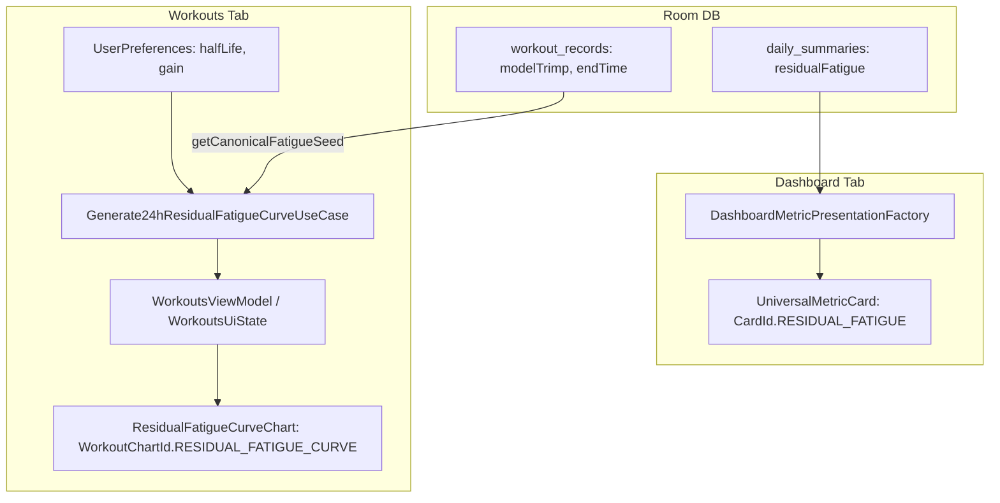

# Residual Fatigue UI & Visualizations Design Specification

**Date:** 2026-08-29  
**Status:** Approved  
**Scope:** Dashboard Stats Card (`CardId.RESIDUAL_FATIGUE`) and Workouts 24-hour Residual Fatigue Curve Chart (`WorkoutChartId.RESIDUAL_FATIGUE_CURVE`).

---

## 1. Executive Summary

This specification defines the UI presentation and visualization layer for Residual Fatigue in Readylytics:
1. **Dashboard Stats Card:** A customizable, default-hidden stats card on the main Dashboard displaying the current day's Residual Fatigue snapshot as a Gauge, Bar, or Value (0–100 scale, color-classified).
2. **24-Hour Workouts Curve Chart:** A customizable, default-hidden Cartesian line chart on the Workouts tab displaying the continuous exponential decay curve over the selected 24-hour day (midnight to midnight) with 15-minute sampling and exact workout impulse peaks.

---

## 2. Architecture & Data Flow

### 2.1 Principles
- **Room as Single Source of Truth:** Visualizations never query Health Connect directly.
- **On-Demand Timeline Computation:** The 24-hour curve is generated in pure Kotlin on-demand by sampling the active exponential decay model over canonical workout records. No intermediate 15-minute samples are persisted in Room.
- **Phase 1 Shadow Isolation:** Visualizations display the computed fatigue values for user insight only; Readiness, Load Score, and recommendations remain untouched.

---

## 3. Dashboard Stats Card (`CardId.RESIDUAL_FATIGUE`)

### 3.1 Card Configuration & Defaults
- **Enum Entry:** `CardId.RESIDUAL_FATIGUE`
- **Default Visibility:** `isVisible = false` (hidden by default in `SettingsDefaults.DEFAULT_DASHBOARD_CARDS`).
- **Supported Display Modes:** `listOf(DashboardCardDisplayMode.GAUGE, DashboardCardDisplayMode.BAR, DashboardCardDisplayMode.VALUE)`
- **Default Display Mode:** `DashboardCardDisplayMode.GAUGE`

### 3.2 Visual & Status Presentation
- **Scale:** `UniversalMetricVisual.Score(rawValue = residualFatigue, minValue = 0f, maxValue = 100f)`
  - Values $> 100$ are displayed accurately in text and visually clamped to 100% fill on Gauge/Bar.
- **Status Classification:**
  - $\text{fatigue} < 30$: `MetricStatus.OPTIMAL` (Low fatigue)
  - $30 \le \text{fatigue} \le 70$: `MetricStatus.NEUTRAL` (Moderate fatigue)
  - $\text{fatigue} > 70$: `MetricStatus.WARNING` (High fatigue)
  - When `residualFatigue == null` or fatigue is disabled in preferences: `MetricStatus.NO_DATA` / `UniversalMetricUnavailableReason.MISSING_VALUE`.
- **Text & Copy:**
  - **Title:** `R.string.card_residual_fatigue_title` ("Residual Fatigue")
  - **Secondary Text:** `R.string.card_residual_fatigue_secondary` (e.g. `"Half-life: 24h"`)
  - **Tooltip:** `R.string.tooltip_residual_fatigue`
- **Interaction:** Tapping the card invokes `onNavigateToWorkouts()`.

---

## 4. 24-Hour Residual Fatigue Timeline Chart (`WorkoutChartId.RESIDUAL_FATIGUE_CURVE`)

### 4.1 Chart Configuration & Defaults
- **Enum Entry:** `WorkoutChartId.RESIDUAL_FATIGUE_CURVE`
- **Default Visibility:** `isVisible = false` (hidden by default in `SettingsDefaults.DEFAULT_WORKOUT_CHARTS`).
- **Placement:** Managed via Workouts chart reordering / visibility bottom sheet (`WorkoutsChartFactory`).

### 4.2 Mathematical Sampling Engine (`Generate24hResidualFatigueCurveUseCase`)
- **Inputs:**
  - `selectedDate: LocalDate`
  - `scoringZoneId: ZoneId`
  - `config: ResidualFatigueConfig` (`halfLifeHours`, `gain`)
  - `retainedWorkouts: List<FatigueWorkoutInput>` (all canonical workouts with `startTime < dayEndMs`)
- **Sampling Strategy:**
  - 96 quarter-hour grid points (every 15 minutes from `00:00` to `23:45`).
  - Exact `endTimeMs` timestamps for every workout ending within the 24-hour day window.
  - Merged and sorted chronologically: $t_0 < t_1 < \dots < t_N$.
- **Evaluation Formula:**
  $$F(t) = \sum_{i: \text{endTime}_i \le t} \text{gain} \times \text{trimp}_i \times 2^{-\frac{t - \text{endTime}_i}{\text{halfLifeHours} \times 3600 \times 1000}}$$
- **Output:** List of `FatiguePoint(timestampMs: Long, timeMinutesOfDay: Float, fatigueValue: Float)`

### 4.3 Vico Chart Presentation (`ResidualFatigueCurveChart.kt`)
- **Line Layer:** Cubic Bézier interpolation with smooth curve rendering.
- **Area Fill:** Gradient below the line from `MaterialTheme.colorScheme.primary.copy(alpha = 0.25f)` to transparent.
- **Y-Axis:** Dynamic range starting at 0 and scaling to $\max(100f, \text{peakToday})$.
- **X-Axis:** 4-hour interval time labels (`00:00`, `04:00`, `08:00`, `12:00`, `16:00`, `20:00`, `24:00`).
- **Touch Scrubber Tooltip:** Shows time in `HH:mm` format and exact fatigue value (e.g. `14:15 • Fatigue: 38.4`).
- **Container:** Native M3 `Card` with `MaterialTheme.shapes.large` (16dp) and `surfaceContainerLow` surface role.

---

## 5. Advanced Settings UI Polish

### 5.1 Header & Switch Layout
- In `AdvancedResidualFatigueSection.kt`:
  - **Header Row:** Add `MetricTooltip` alongside `advanced_residual_fatigue_title` containing the comprehensive explanation (`advanced_residual_fatigue_desc` / guardrails note).
  - **Switch ListItem:** Simplify the label to "Enabled" (`advanced_residual_fatigue_enabled_label`), removing the redundant long `supportingContent` block from the row so the toggle remains clean, compact, and aligned with standard settings rows.

---

## 6. Testing & Verification

1. **Unit Tests:**
   - `DashboardMetricPresentationFactoryTest`: Verify presentation, status classification thresholds (<30, 30-70, >70), secondary text, and missing value handling.
   - `Generate24hResidualFatigueCurveUseCaseTest`: Verify 15-minute grid generation, exact workout impulse insertion, decay accuracy at midnight boundaries, and empty history handling.
   - `DashboardCardCatalogTest` & `WorkoutChartIdExtensionsTest`: Verify catalog spec, supported modes, default visibility, and proto serialization.
   - `SettingsViewModelTest` / Compose verification: Verify clean header layout with info icon and simplified "Enabled" switch.
2. **Regression & Quality Gates:**
   - Pre-commit gates: `ktlintFormat`, `detekt`, `assembleDebug`, `testDebugUnitTest`, `lintRelease`.
